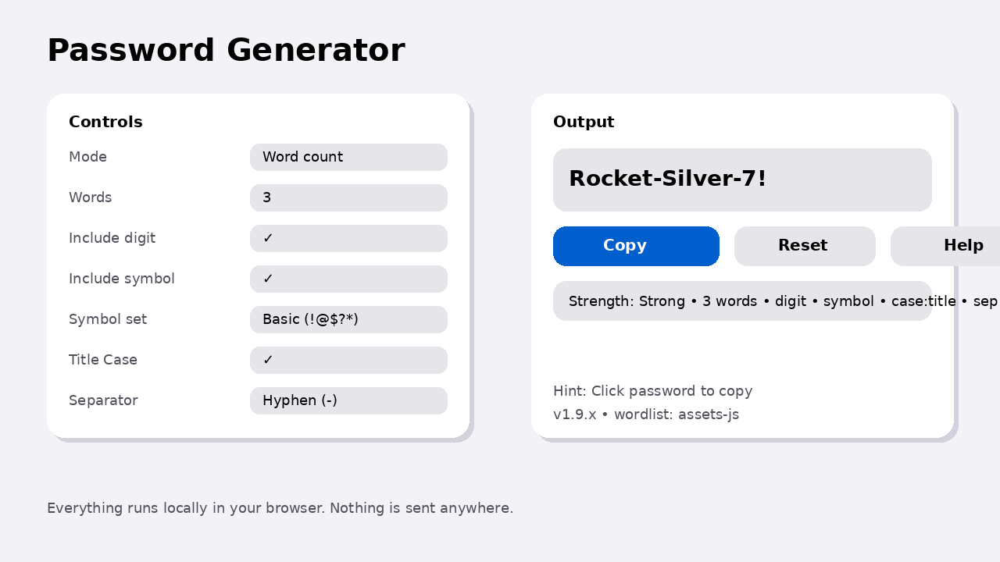

# Password Generator

A single‑page, browser‑only password generator that produces **memorable, word‑based** passwords (with optional digits/symbols) and runs entirely on the client.

## Features

- **Two modes**
  - **Exact length**: generate a password of 8/12/15/… characters
  - **Word count**: generate 2/3/4/… recognizable words (optionally separated)
- **Policy controls**
  - Toggle **Include digit**
  - Toggle **Include symbol**
  - Choose **Symbol set**: Basic / Extended / Custom
- **Word styling (Word count mode)**
  - **Title Case** on/off
  - **Separator**: none / `-` / `_` / `.`
- **Copy UX**
  - Copy button feedback (“Copied!”)
  - Click the password itself to copy
- **Remembers your settings** (localStorage) + **Reset** button
- **Wordlist loading**: prefers `assets/words_v1.js`, falls back to `assets/words_v1.json`, then a small built‑in fallback list
- **Privacy**: everything runs locally in your browser (nothing is sent anywhere)

## Project structure

```
.
├── index.html
├── assets/
│   ├── words_v1.js
│   └── words_v1.json
└── tools/
    └── build_wordlist.py
```

## Run locally

Because the app loads the wordlist via fetch, you should run it from a local server (not `file://`).

### Option A: Python

```bash
python3 -m http.server 8000
```

Open:

- http://localhost:8000

### Option B: Node (http-server)

```bash
npx http-server -p 8000
```

## Deploy (GitHub Pages)

1. Push to GitHub.
2. In the repo: **Settings → Pages**
3. Set **Source** to `Deploy from a branch`
4. Pick branch `main` and folder `/root` (or whatever your repo uses)
5. Save, then wait a minute and open the Pages URL.

## Screenshot



## License

MIT (or add your preferred license).
